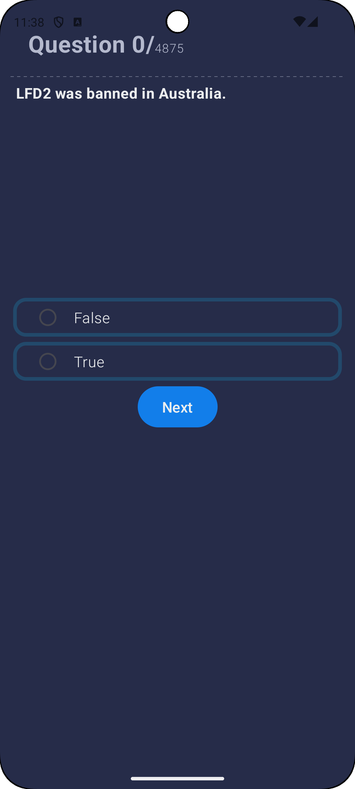
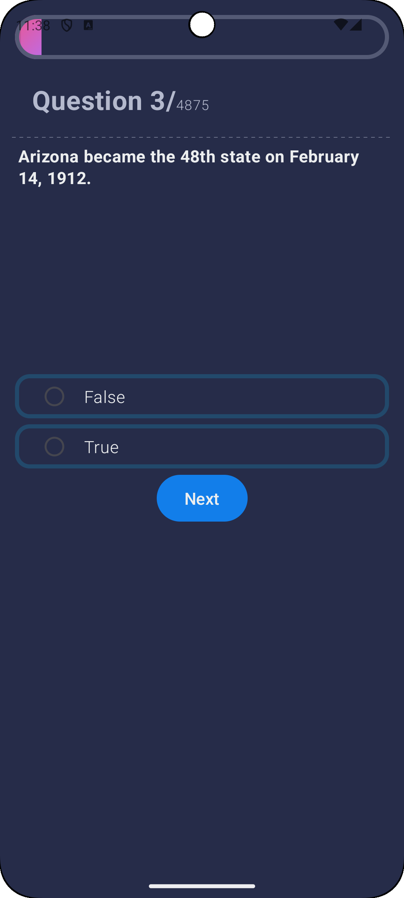
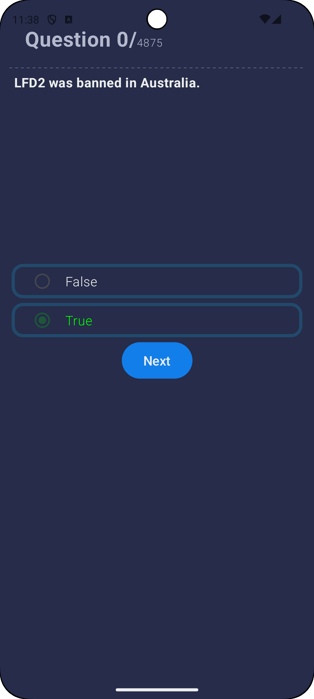
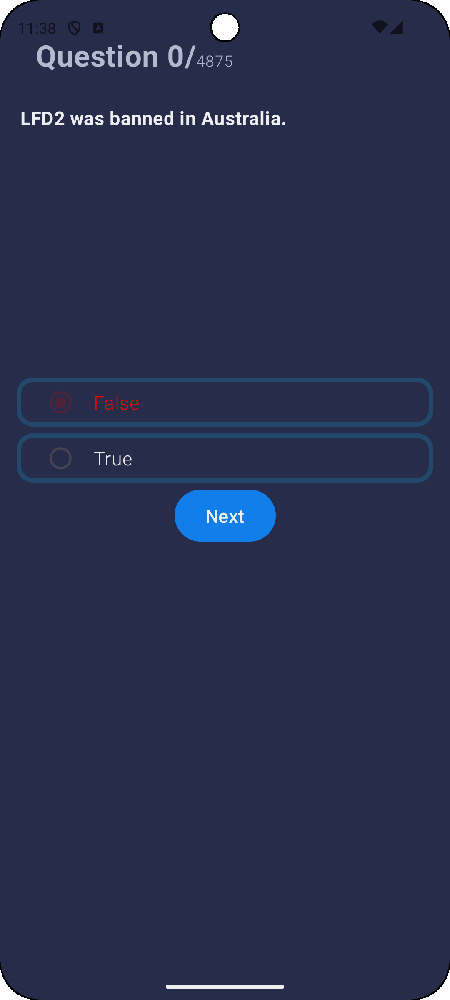

# TriviaApp

- トリビアアプリ

## 使用技術

 

## 画面仕様

 第1問                                          | 第3問以降                    
----------------------------------------------|--------------------------
                        |  
 問題文、選択肢、Nextボタンが表示 上部に(現在の問題数)/(総問題数)が表示 | インジケーターが表示               

正解 | 不正解                     
----------------------------------------------|--------------------------~~~~
 | 
ラジオボタン、選択肢が緑で表示 | ラジオボタン、選択肢が赤で表示         
